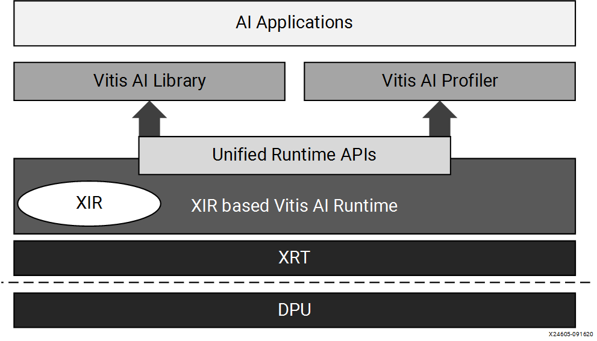
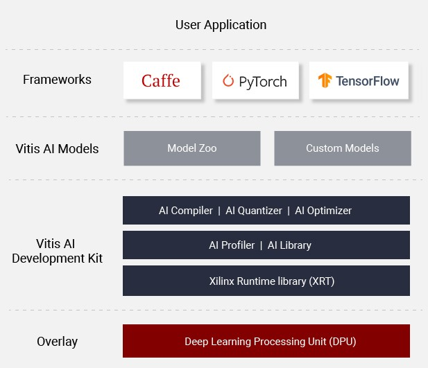
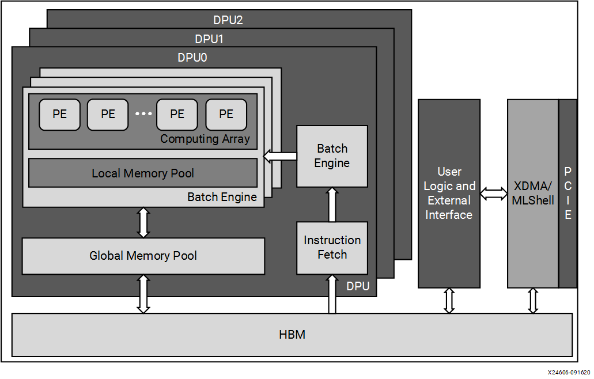
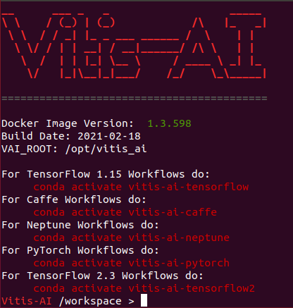
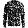
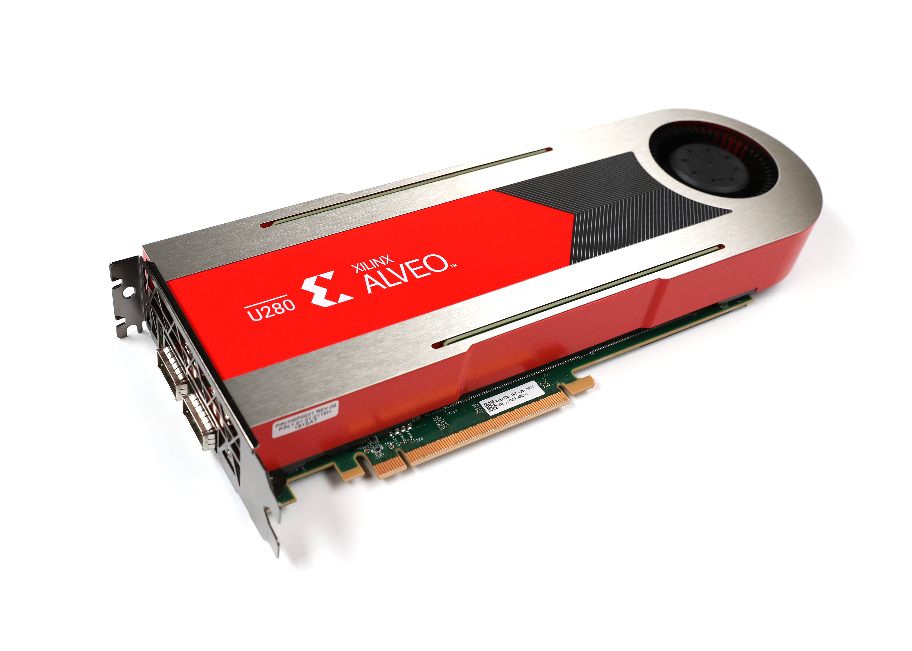

# GAN with Vitis AI
This project aims to implement a GAN (Generative Adversarial Networks) on a hardware accelerator to generate images from input noise. More specifically, the goal is to reduce the duration of the inference phase when running the generator from the GAN model, and perform the appropriate transformations on the model in order to execute it on the embedded board. We will be using the Vitis AI framework from [Xilinx](https://www.xilinx.com/ "Xilinx").

### Table of contents
1) [Context](#context)
2) [Vitis AI](#vitis)
3) [GAN](#gan)
4) [Requirements](#requirements)
5) [User Guide](#guide)
6) [Results](#results)
7) [Axes of improvement](#improvement)
8) [References](#references)

---
<div id='context'/>

## 1) Context
A deep-learning model is caracterized by two distinct computation-intensive processes that are training and inference. [During the training step, the model is taught to perform a specific task. On the other hand, inference is the deployment of the trained model to perform on new data](https://www.intel.com/content/www/us/en/artificial-intelligence/posts/deep-learning-training-and-inference.html "The Difference Between Deep Learning Training and Inference"). Real-time inference of deep neural network (DNN) models is a big challenge that the Industry faces, with the growth of latency constrained applications. For this reason, inference acceleration has become more critical than faster training. [While the training step is most often carried out by GPUs, due to their high throughput, massive parallelism, simple control flow, and energy efficiency](https://medium.com/syncedreview/deep-learning-in-real-time-inference-acceleration-and-continuous-training-17dac9438b0b "Deep Learning in Real Time — Inference Acceleration and Continuous Training"), FPGA devices (Field Programmable Gate Arrays) are more adapted to AI inference, by providing better performance per watt of power consumption than GPUs thanks to their flexible hardware configuration.

An important axis of research is the deployment of AI models on embedded platforms. To achieve that, along with smaller neural network architectures, some techniques like quantization and pruning allow to reduce the size of existing architectures without losing much accuracy. It minimizes the hardware footprint and energy consumption of the target board. These techniques perform well on FPGAs, over GPU.

One significant issue about conjugating AI inference with hardware acceleration is the expertise required in both domains, especially regarding low level development on accelerator cards. Fortunately, some frameworks make hardware more accessible to software engineers and data scientists. [With the Xilinx’s Vitis AI toolset, we can quite easily deploy models from Keras-TensorFlow straight onto FPGAs](https://beetlebox.org/vitis-ai-using-tensorflow-and-keras-tutorial-part-1/ "Vitis AI using TensorFlow and Keras Tutorial"). 

---
<div id='vitis'/>

## 2) Vitis AI
[Vitis™](https://www.xilinx.com/products/design-tools/vitis.html "Vitis") is a unified software platform for embedded software and accelerated applications development on Xilinx® hardware platforms, with [Edge, Cloud or Hybrid computing](https://www.redhat.com/en/topics/cloud-computing/cloud-vs-edge "Cloud vs Edge computing"). The application code can be developed using high-level programming languages such as C++ and Python.

[Vitis™ AI](https://www.xilinx.com/products/design-tools/vitis/vitis-ai.html "Vitis AI") is a development environment whose purpose is to accelerate AI inference. Thanks to optimized [IP cores](https://anysilicon.com/ip-intellectual-property-core-semiconductors/ "IP core") and tools, it allows to implement pre-compiled or custom AI models and provides libraries to accelerate the application by interacting with the processor unit of the target platform. With Vitis AI, the user can easily develop [Deep Learning](https://machinelearningmastery.com/what-is-deep-learning/ "Deep Learning") inference applications without having a strong FPGA knowledge.



We chose to use the Vitis AI TensorFlow framework. For more information on Vitis AI, please refer to the official [user guide](https://www.xilinx.com/html_docs/vitis_ai/1_3/ "User Guide").



In our case, the hardware platform is an [Alveo™ Data Center Accelerator Card](https://www.xilinx.com/products/boards-and-kits/alveo.html "Alveo"). This [FPGA (Field Programmable Gate Arrays)](https://www.xilinx.com/products/silicon-devices/fpga/what-is-an-fpga.html "Xilinx FPGA") is a Cloud device to accelerate the computing workloads of deep learning inference algorithms. Its processor unit is called a  [Deep-Learning Processor Unit (DPU)](https://www.xilinx.com/html_docs/vitis_ai/1_3/tools_overview.html#nwc1570695738475 "DPU"), a a group of parameterizable IP cores pre-implemented on the hardware optimized for deep neural networks, compatible with the Vitis AI specialized instruction set. Different versions exists so as to offer different levels of throughput, latency, scalability, and power. The [Alveo U280 Data Center Accelerator Card](https://www.xilinx.com/products/boards-and-kits/alveo/u280.html "Alveo U280") supports the [Xilinx DPUCAHX8H DPU](https://www.xilinx.com/html_docs/vitis_ai/1_3/tools_overview.html#xyt1583919665886 "DPUCAHX8H") optimized for high throughput applications involving [Convolutional Neural Networks (CNNs)](https://towardsdatascience.com/a-comprehensive-guide-to-convolutional-neural-networks-the-eli5-way-3bd2b1164a53 "Convolutional Neural Networks"). It is composed of a high performance scheduler module, a hybrid computing array module, an instruction fetch unit module, and a global memory pool module.



---
<div id='gan'/>

## 3) GAN
**[Here](DOC/GAN.md "GAN model")**, we present the GAN network to be implemented on the accelerator card. The concept is to create or import a machine learning model from a popular Machine Learning framework (TensorFlow, Caffe, Pytorch ...) and then optimize it to fit the accelerator card.

---
<div id='requirements'/>

## 4) Requirements
Before running the project, check the [requirements from Vitis AI](https://www.xilinx.com/html_docs/vitis_ai/1_3/oqy1573106160510.html "Minimum system requirements") and make sure to complete the following steps :
- **[Install the Vitis AI Docker image](DOC/Docker_&_Vitis_AI.md "Install Vitis AI Docker")**
- **[Set up the Alveo U280 accelerator card](DOC/Alveo_Setup.md "Alveo U280 setup")**

**Versions** :
- Docker : 20.10.6
- Docker Vitis AI image : 1.3.598   
- Vitis AI : 1.3.2      
- TensorFlow : 1.15.2
- Python : 3.6.12
- Anaconda : 4.9.2

**Hardware** :
- [Alveo U280 Data Center Accelerator Card](https://www.xilinx.com/products/boards-and-kits/alveo/u280.html "Alveo U280")

---
<div id='guide'/>

## 5) User Guide
In this section, we are going to explain how to run the project. \
This project is executed through a succession of bash files, located in the */workflow/* folder. \
You may need to first set the permissions for the bash files :
```
cd ./docker_ws/workflow/
chmod +x *.sh
cd ..
chmod +x *.sh
```
You can either run the scripts from the */workflow/* folder step by step, or run the two main scripts. \
The first script to run serves to open the Vitis AI image in the Docker container. \
Indeed, we can use the Vitis™ AI software through [Docker Hub](https://www.docker.com/ "Docker"). It contains the tools such as the Vitis AI quantizer, AI compiler, and AI runtime for cloud DPU. We chose to use the Vitis AI Docker image for host [CPU](https://blogs.nvidia.com/blog/2009/12/16/whats-the-difference-between-a-cpu-and-a-gpu/ "CPU vs GPU").
```
cd docker_ws
 source ./workflow/0_run_docker_cpu.sh
```



Then, run the following script to execute the whole process.
```
 source ./run_all.sh
```
This project is based on the workflow from Vitis AI tutorials using the [Anaconda](https://www.anaconda.com/ "Anaconda") environment for [TensorFlow](https://www.tensorflow.org/?hl=en "TensorFlow"), such as the [MNIST Classification using Vitis AI and TensorFlow 1.15](https://github.com/Xilinx/Vitis-Tutorials/tree/master/Machine_Learning/Design_Tutorials/02-MNIST_classification_tf "MNIST Classification using Vitis AI and TensorFlow 1.15"). 

For more details, please consult this **[guide](DOC/Documentation.md "Documentation")**.

---
<div id='results'/>

## 6) Results
In this section, we compare the performances of the original GAN generator running on the CPU of the host machine to its modified version running on the Alveo U280 accelerator card. In case you get an issue when running the script to evaluate the performances, this may be due to the previous installation of TensorFlow to run the App. In this case, open a new instance of Docker and run the evaluation only.

For this test, we trained the model on 40 epochs. At each run, we generate 50 images with the trained generator model. We use a seed of 42.

- Image from the training set : 

- Image produced by running the original model on the CPU : 

- Image produced by running the quantized graph on the CPU : 

- Image produced by running app on the Alveo U280 FPGA : 

For each case, we measured the duration of the inference phase, excluding the preprocessing and postprocessing steps.

| Original (CPU) | Quantized graph (CPU) | App (Alveo U280) |
|   :---:        |     :---:             |      :---:       | 
|   82 ms        |    116 ms             |      0.5 ms      |

We can deduce from this test that the App running on the Alveo U280 is 164 times faster than the software run on the CPU of the host machine.

We then used different techniques to try to evaluate the performances of the generator running on the Alveo accelerator card :
- Classification : We run the original discriminator model (binary classifier) on the host machine over the output images to evaluate their degree of realism. Let's measure the average score that gets the generator on the host machine and the accelerator card, and the percentage of images that got a confidence over 50 %. We notice below the loss of quality of the GAN generator, that loses 63% of images detected as real images. The reason could be that the postprocessing step differs between both programs.

| Model                         | Original (CPU)   | App (Alveo U280) |
| :---:                         |   :---:          |  :---:           | 
| Average score                 |    96 %          |  33%             |
| Percentage of images over 0.5 |    96 %          |  16 %            |

- [FID (Frechet Inception Distance)](https://machinelearningmastery.com/how-to-implement-the-frechet-inception-distance-fid-from-scratch/ "How to Implement the Frechet Inception Distance (FID) for Evaluating GANs") score : Evaluate the quality of the generator's output by measuring the distance between feature vectors calculated for real and generated images. The compared feature vectors (activations) come from the [Inception V3 classificator](https://keras.io/api/applications/inceptionv3/ "Inception V3"), pre-trained on the [ImageNet dataset](https://www.image-net.org/ "ImageNet"). The goal is to evaluate synthetic images based on the statistics of a collection of synthetic images compared to the statistics of a collection of real images from the training set. An FID score of 0.0 means that both batches of images are identical. 

| Model                         | Original (CPU)   | App (Alveo U280) |
| :---:                         |   :---:          |  :---:           | 
| FID score                     |    15.3          |  47.3            |

Again, the output images of the generator running on the host machine are closer to the dataset images than the one running on the accelerator card. 

- [SSIM (Structural Similarity Index)](https://www.pyimagesearch.com/2017/06/19/image-difference-with-opencv-and-python/ "Image Difference with OpenCV and Python") : Compare the output images to the gold ones (produced by a GAN on a GPU using the same original model), two by two, using the SSIM (Structural Similarity Index) in order to evaluate the loss of quality of the GAN's generator. A score of 1.0 indicates that both images are identical, while 0.0 means the opposite. Let's measure the SSIM score between the gold data, produce by the original generator model running on the host machine, and the output of the transformed model running on the accelerator card.

| SSIM score | 15 %  |
| :---:      | :---: | 

This score is low due to the fact that the output images are not similar two by two, despite setting the seed value that determines randomness, and using the same function to generate the input noise. 

---
<div id='improvement'/>

## 7) Axes of improvement
- Profile the execution using [vaitrace](https://www.xilinx.com/html_docs/vitis_ai/1_3/profiling.html "Vitis AI Profiler");
- Try to run the application with more than one thread. You can get some advice [here](https://beetlebox.org/vitis-ai-using-tensorflow-and-keras-tutorial-part-9/ "Threads"), and adapt the code the measure the right execution time on DPU taking into account the several threads;
- Despite specifying the input shape during the compilation process, the input tensor in the application code changes of shape. Try to correct this issue;
- Although we set at each run the seed for randomness and use the same function to generate the Gaussian distribution hat serves as input, the generated images are not of the same type so we can't apply the SSIM metric. Try to correct this issue;
- Find other ways to evaluate the [GAN](https://machinelearningmastery.com/how-to-evaluate-generative-adversarial-networks/ "How to Evaluate Generative Adversarial Networks");
- Change the size of the noise matrix that the generator takes as input;
- Play with the number of epochs.

In order to implement your own GAN model (that still generates images from noise input), modify the script *3_train_model.sh* responsible for building and training the model, and make changes in the *1_set_env.sh* script to set the new shapes and tensor names.

---
<div id='references'/>

## 8) References
The mentionned projects below were used for this project as tools or source of inspiration :
- [Hands-on Machine Learning with Scikit-Learn, Keras, and TensorFlow by Aurélien Géron](https://github.com/ageron/handson-ml2 "/ageron/handson-ml2")
- [TF Keras YOLOv4/v3/v2 Modelset by David8862](https://github.com/david8862/keras-YOLOv3-model-set "david8862/keras-YOLOv3-model-set")
- [Xilinx - Vitis AI Tutorials](https://github.com/Xilinx/Vitis-Tutorials/tree/master/Machine_Learning "Vitis AI tutorials")


